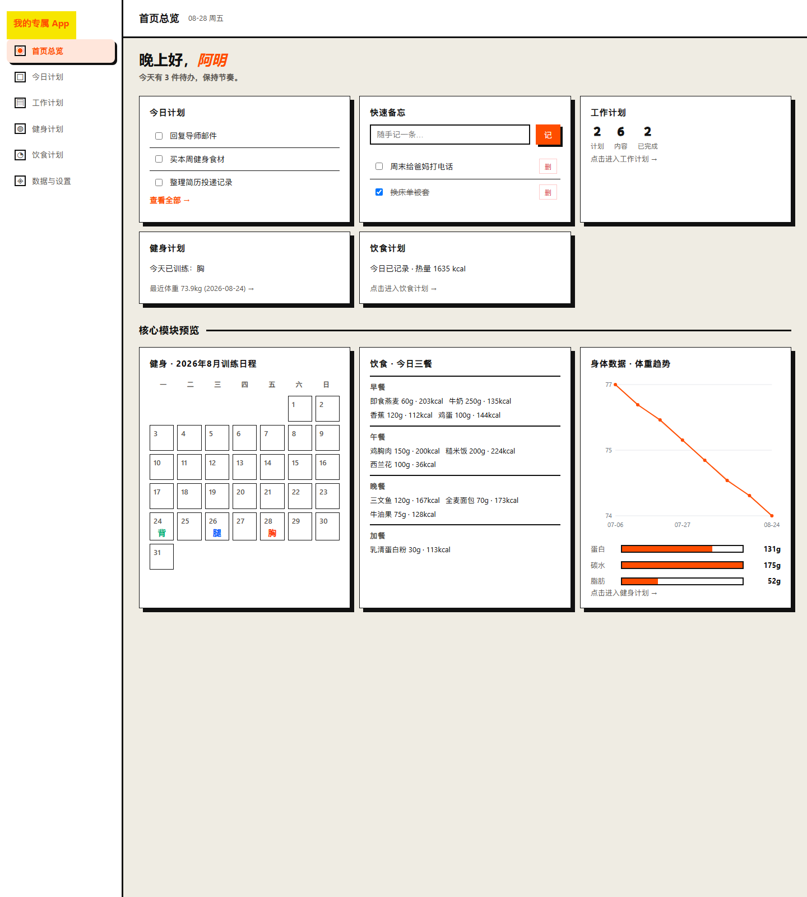
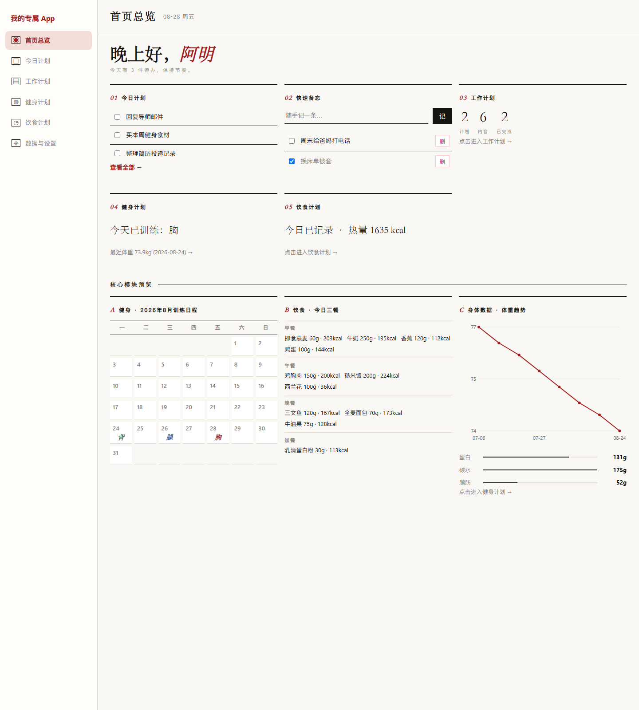
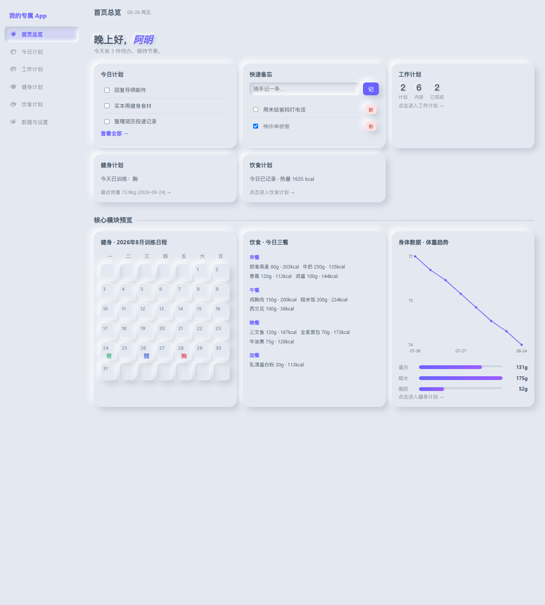
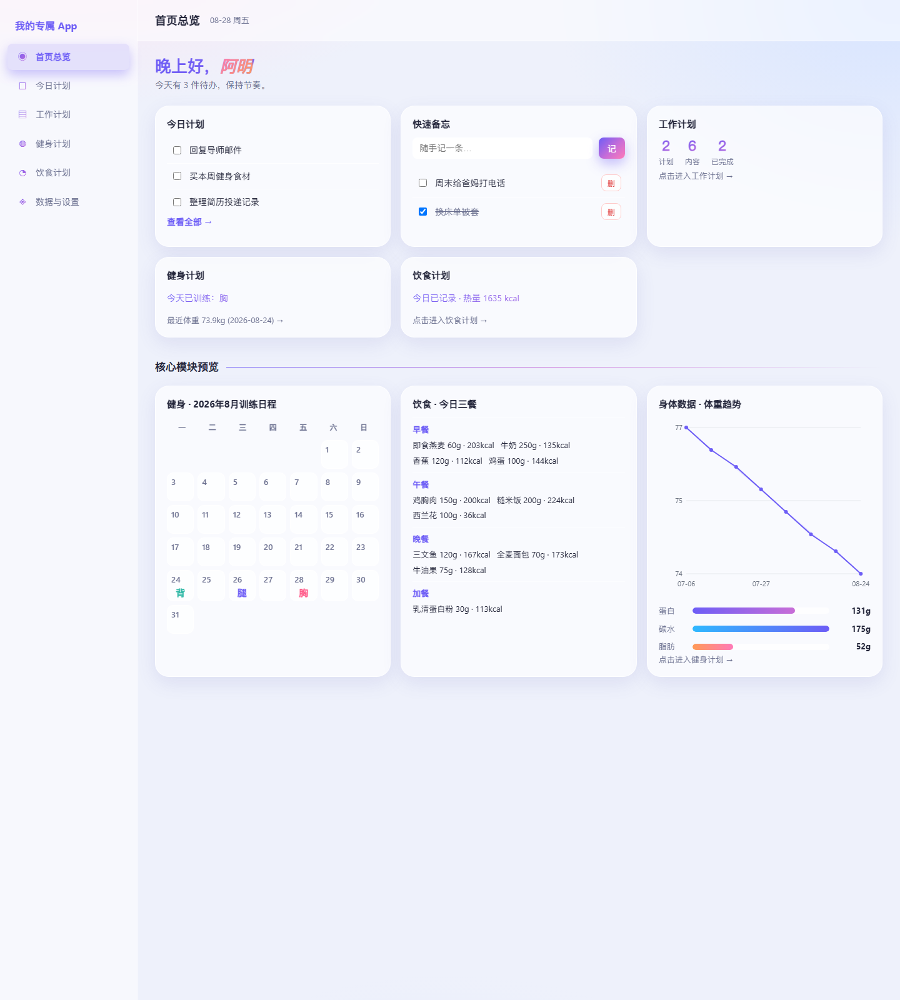
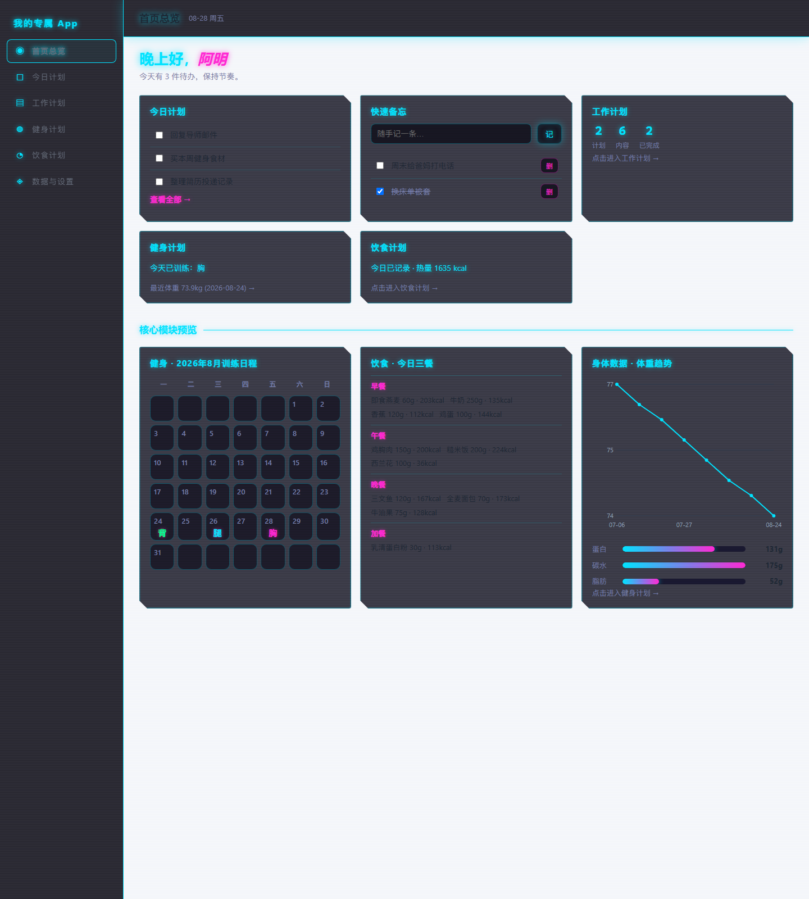
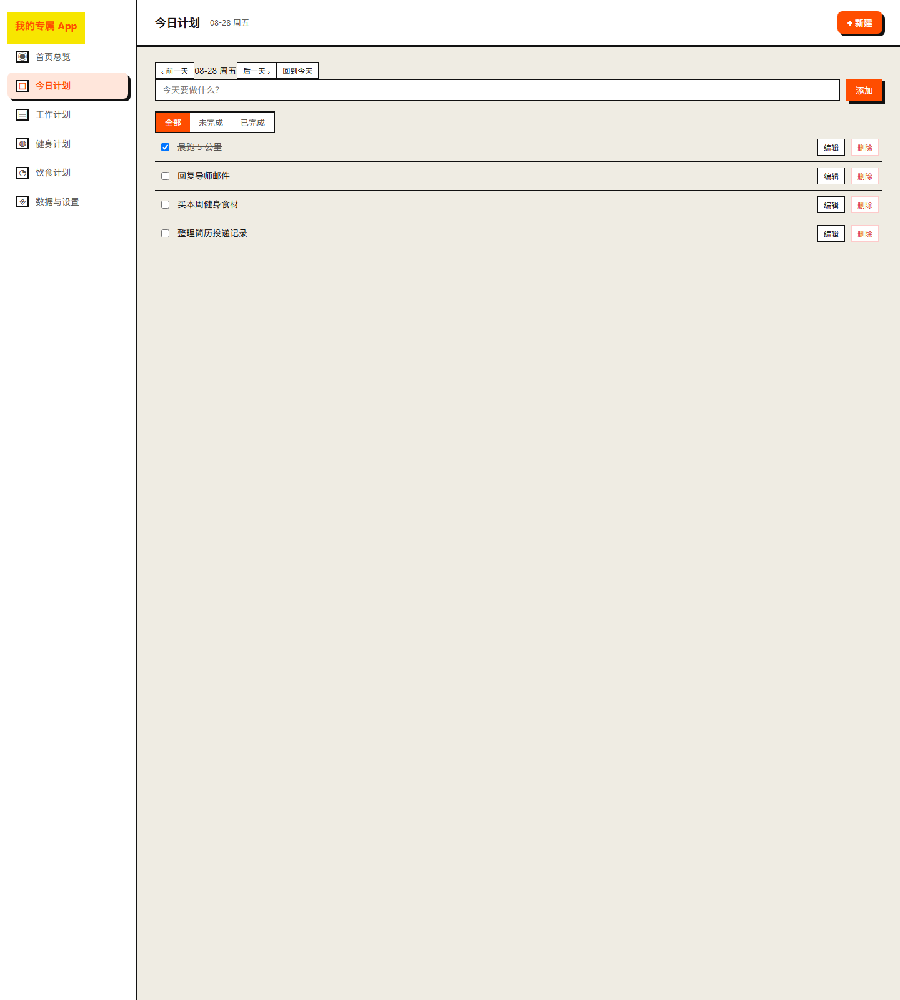
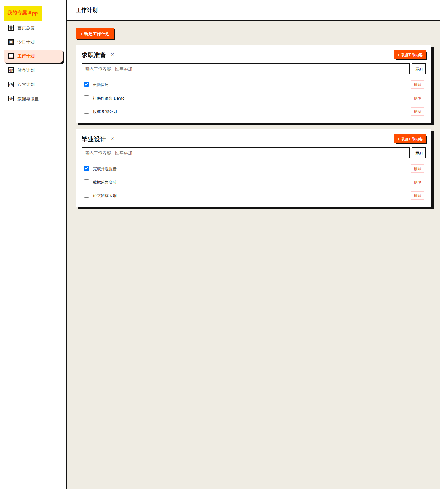
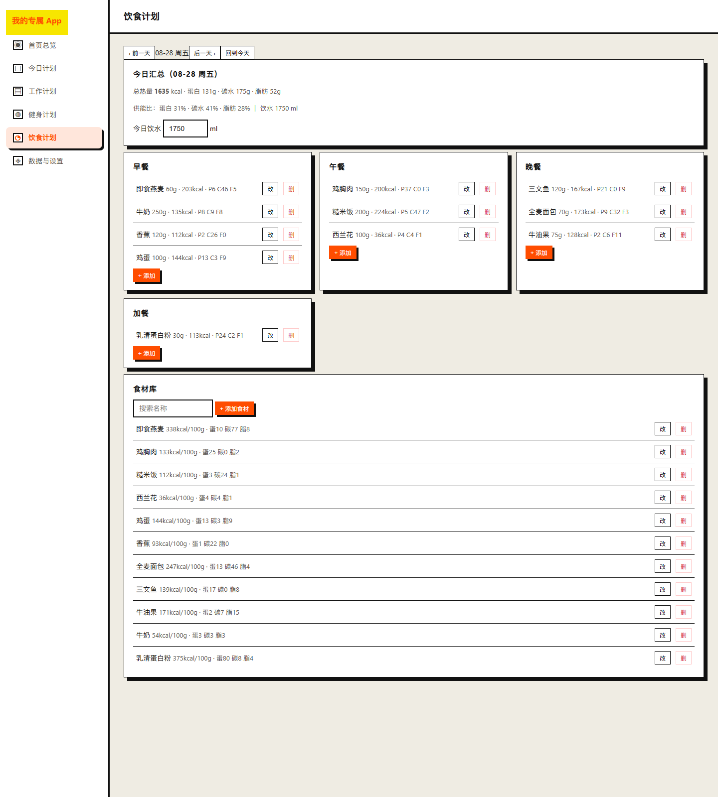

# 个人生活 App

> 只给自己用的本机浏览器应用 —— 待办 · 工作 · 健身 · 饮食 · 备忘，一页看清今天
> 纯 HTML + CSS + 原生 JavaScript，零依赖、零构建、离线运行；双击 `index.html` 即可使用。

    

## 目录

- [核心特性](#核心特性)
- [界面预览](#界面预览)
- [功能模块](#功能模块)
- [界面风格](#界面风格)
- [快速开始](#快速开始)
- [数据与备份](#数据与备份)
- [技术栈与设计约束](#技术栈与设计约束)
- [项目结构](#项目结构)
- [测试](#测试)
- [文档](#文档)
- [常见问题](#常见问题-faq)
- [许可](#许可)

## 核心特性

- **零依赖零构建** —— 纯 HTML + CSS + 原生 JS，无 npm / 框架 / 打包步骤
- **完全离线运行** —— 图表原生 SVG 手绘，无 CDN、无外部资源，`file://` 协议直接打开
- **数据本地存储** —— 写入浏览器 `localStorage`，不联网、不登录、不上云
- **6 大模块** —— 首页总览 / 今日计划 / 工作计划 / 健身计划 / 饮食计划 / 数据与设置
- **5 套界面风格** —— 野兽派 / 编辑杂志风 / 新拟物派 / 现代渐变风 / 赛博朋克风，每套亮色风格附专属暗色版
- **导入导出备份** —— JSON 文件一键备份与恢复，数据清空需二次确认

## 界面预览

### 首页总览


### 5 套界面风格

在「数据与设置 → 界面风格」中点击任意一张缩略图即可即时换肤，并自动保存到 `localStorage`。每套亮色风格附专属暗色版，赛博朋克为恒暗风格。

| 野兽派 · brutal | 编辑杂志风 · editorial |
| :---: | :---: |
|  |  |
| **新拟物派 · neumorph** | **现代渐变风 · gradient** |
|  |  |
| **赛博朋克风 · cyber（恒暗）** | |
|  | |

> 以上为同一「首页总览」在 5 套风格下的实际效果；点击缩略图即时换肤，选择器在「数据与设置 → 界面风格」。

### 功能模块

| 首页总览 | 今日计划 |
| :---: | :---: |
|  |  |
| **工作计划** | **健身计划** |
|  |  |
| **饮食计划** | **数据与设置** |
|  |  |

## 功能模块

### 首页总览
聚合页：时段问候、昵称、今天要做的事（今日计划）、快速备忘、四个模块的关键摘要，以及核心模块（健身月历 / 今日三餐 / 体重趋势）的预览。设计为"看"和"轻操作"为主，不做重编辑。

### 今日计划
按日期组织的通用待办。每条 `{date, text, done}`，支持勾选、按状态筛选、任意日期补录与回看；与工作 / 健身 / 饮食三模块数据隔离。

### 工作计划
采用「工作计划卡 → 工作内容」的扁平模型：一张卡片代表一个计划（含标题与若干工作内容），工作内容仅为文本与完成态，无优先级、截止日或状态流转。

### 健身计划
- **训练日程**：以日期为键的训练安排，每天一个「训练部位」与 5 个固定动作
- **训练部位**：胸 / 肩 / 背 / 腿 / 有氧 五选一
- **身体数据**：体重 / 体脂记录，叠加原生 SVG 手绘的体重趋势折线图

### 饮食计划
- **餐次**：早餐 / 午餐 / 晚餐 / 加餐 四个固定餐次
- **食材库**：每条 `{name, per100g:{kcal, protein, carb, fat}}`，营养以每 100g 为基准
- **当日汇总**：自动合计当天所有餐次的总热量与三大宏量营养素 + 供能比
- **饮水**：独立于餐次的饮水量记录

### 数据与设置
- 昵称、界面风格（5 选 1）、深色模式
- 数据导出（JSON）/ 导入恢复（覆盖前确认）
- 数据清空（**二次确认**）

## 界面风格

| 风格键 | 风格名 | 视觉特点 |
| :--- | :--- | :--- |
| `brutal` | 野兽派 | 硬边框 + 高对比（默认） |
| `editorial` | 编辑杂志风 | 衬线排版 + 细线分隔 |
| `neumorph` | 新拟物派 | 柔浮雕 + 凹槽质感 |
| `gradient` | 现代渐变风 | 渐变光斑 + 毛玻璃 |
| `cyber` | 赛博朋克风 | 霓虹 + 扫描线（恒暗） |

- 风格键走 `body[data-skin]` 属性；选择器存于 `localStorage`，刷新 / 重启不丢失
- 明 / 暗 是全局开关（`darkMode`），与风格独立：每套亮色风格附专属暗色版
- 赛博朋克为恒暗风格，深色开关对其无额外效果

## 快速开始

1. 克隆或下载本仓库
2. 双击 `index.html`，用 **Chrome / Edge / Firefox** 打开
3. 开始记录 —— 无需安装、无需构建、无需登录

> 所有数据保存于本机浏览器 `localStorage`，关闭 / 刷新 / 重启不丢失。换浏览器或清除浏览器数据则会丢失，请定期导出备份（见下）。

## 数据与备份

- **存储位置**：浏览器 `localStorage`（与浏览器 profile 绑定）
- **导出备份**：进入「数据与设置 → 数据与备份 → 导出备份」，得到一份 JSON 文件 —— 这是防丢的**唯一手段**
- **导入恢复**：在「数据与设置」中上传之前导出的 JSON 文件，覆盖前会二次确认
- **数据清空**：在「数据与设置」中操作，**二次确认**后才执行
- **升级迁移**：从 v1.1 升级到 v1.2 时，旧设置的 `themeColor` 会被丢弃、外观回到默认「野兽派」；其余数据完全保留

## 技术栈与设计约束

| 约束 | 方案 |
| :--- | :--- |
| 双击 `file://` 可用 | 经典 `<script>` 加载，不使用 ES Module / fetch / CDN |
| 零构建 | 纯 HTML + CSS + 原生 JS，无 npm / 框架 |
| 离线图表 | 原生 SVG 手绘体重折线，无 ECharts 等外部库 |
| 路由 | 基于 `hash`（`#/home` 等），`file://` 下最稳 |
| 写操作 | 即时保存，无「保存」按钮 |

> 图表逻辑封装在 `js/chart.js` adapter 中（`W.Chart = { renderWeightTrend, dispose }`），业务模块只传数据、不认识绘图细节。详见 `docs/specs/chart-adapter-seam.md` 与 `docs/adr/0002-chart-adapter-seam.md`。

## 项目结构

```
.
├── index.html              页面外壳：侧边栏 + 主内容区
├── assets/
│   ├── styles.css          业务样式（布局、响应式）
│   └── themes.css          5 套界面风格皮肤（v1.2）
├── js/
│   ├── store.js            数据层：localStorage 读写 / 导入导出 / 清空
│   ├── ui.js               通用工具：toast / 确认框 / 空状态 / 日期
│   ├── chart.js            图表 adapter：原生 SVG 折线（v1.1.1 引入）
│   ├── router.js           hash 路由 + 当前页高亮
│   ├── home.js             首页总览
│   ├── today.js            今日计划
│   ├── work.js             工作计划
│   ├── fitness.js          健身计划
│   ├── diet.js             饮食计划
│   ├── settings.js         数据与设置
│   └── app.js              入口：初始化 / 渲染 / 启动路由
├── tests/                  单元测试（当前 160 项通过）
├── docs/
│   ├── adr/                架构决策记录（ADR）
│   ├── specs/              模块规格说明
│   ├── agents/             Agent 协作约定
│   └── screenshots/        README / 文档截图
├── PRD.md                  产品需求文档
├── 开发计划.md              技术选型与实现清单
├── CONTEXT.md              领域模型 / 术语表
├── CHANGELOG.md            版本变更日志
├── BUG清单.md              已修复 Bug 清单
└── AGENTS.md               Agent 协作约定
```

## 测试

```bash
# 运行全部测试（需 Node 环境，>= 18）
node tests/run-all.js
```

测试覆盖：

- **阶段测试**（`phase0` ~ `phase6`）：从阶段 0 到阶段 6 的功能迭代
- **模块测试**（`diet-modules`、`theming`、`chart-seam`）：饮食、主题、图表 adapter 的专项
- **验收测试**（`acceptance`）：端到端验收场景
- **历史 fix 测试**（`fix-today-1-empty-add`、`fix-today-filter`）：已修复 bug 的回归保护

当前共 **160 项通过，0 失败**。

## 文档

| 文档 | 内容 |
| :--- | :--- |
| `PRD.md` | 产品需求文档（v1.0） |
| `开发计划.md` | 技术选型与实现清单 |
| `CONTEXT.md` | 领域模型 / 术语表（v1.1） |
| `CHANGELOG.md` | 版本变更日志 |
| `BUG清单.md` | 已修复 Bug 清单 |
| `docs/adr/0001-v1.1-domain-simplifications.md` | 领域简化（PRD v1.0 → v1.1） |
| `docs/adr/0002-chart-adapter-seam.md` | 图表 adapter 缝（v1.1.1） |
| `docs/specs/chart-adapter-seam.md` | 图表 adapter 契约 |

## 常见问题 (FAQ)

**问：换浏览器或清除浏览器数据，数据会丢失吗？**
会。`localStorage` 与浏览器的 profile 绑定，换浏览器、清缓存、用无痕模式都会丢数据。**定期导出 JSON 备份**是防丢的唯一手段。

**问：数据存在哪里？会上传到哪里吗？**
所有数据都存在**你本机的浏览器**里。代码里没有任何 fetch / XHR / WebSocket 调用，离线运行，不联网、不登录、不上云。

**问：支持哪些浏览器？**
推荐 **Chrome / Edge / Firefox**。任何支持 `localStorage` 与 ES2015+ 的现代浏览器都可以跑；`file://` 协议下 hash 路由最稳。

**问：怎么备份？多久一次？**
进入「数据与设置 → 数据与备份 → 导出备份」得到一份 JSON 文件。建议每周一次，或在大改前手动备份。导入恢复时会有覆盖前确认。

**问：从 v1.1 升级到 v1.2 数据会丢吗？**
不会，**除了旧的主题色 `themeColor` 会被丢弃**（v1.2 起改为 5 套皮肤 + 深色模式），外观回到默认「野兽派」，其余数据（待办、工作、训练、饮食、备忘、饮水、体重）完全保留。

**问：想换电脑或重装系统怎么办？**
旧机器：导出 JSON；新机器：双击 `index.html` 打开新副本，进入「数据与设置」导入 JSON 即可。无需安装任何依赖。

**问：能卸载吗？**
能。直接删除整个项目文件夹即可 —— 没有安装程序、没有注册表项、没有后台服务。

## 许可

本项目采用 [MIT License](LICENSE) 开源协议。

Copyright (c) 2026 panyuch
