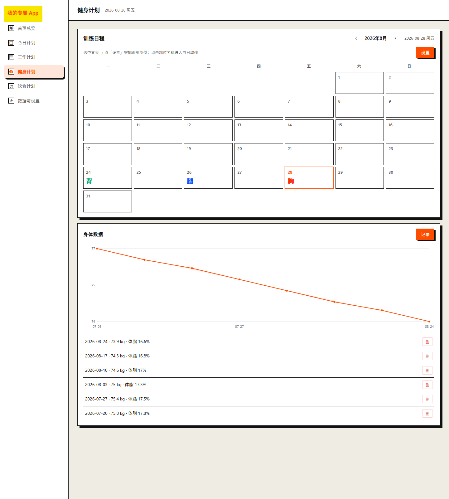
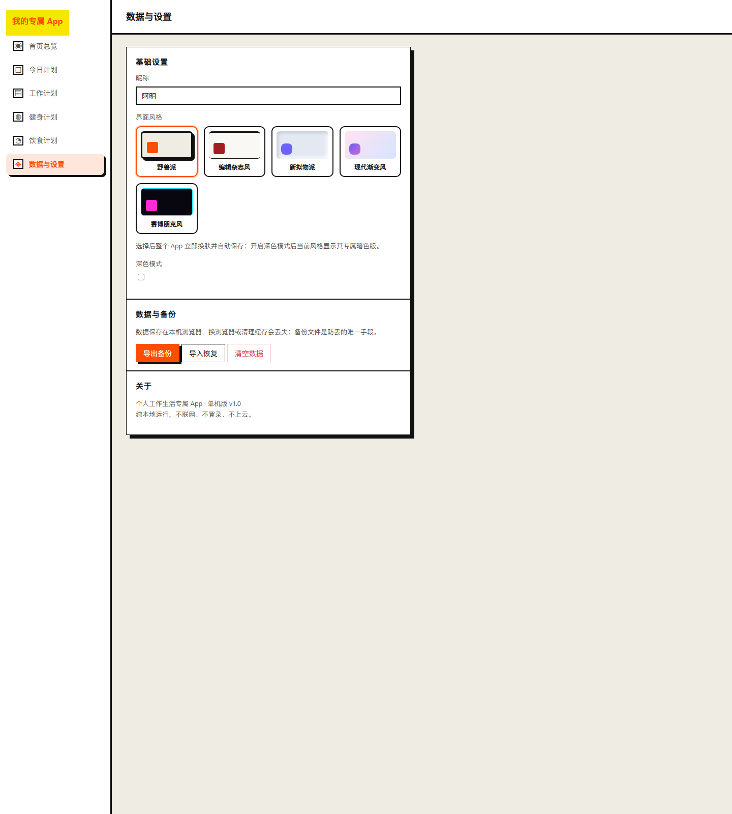

# 我的专属 App

只给自己用的本机浏览器应用：把当天待办、工作、健身、饮食与个人备忘集中在一个页面，一眼看清今天要做什么、做得怎样。

纯 HTML + CSS + 原生 JavaScript 实现，**零依赖、零构建、离线运行**——双击 `index.html` 即可使用。数据保存在浏览器本地（`localStorage`），不联网、不登录、不上云。


## 功能

- **首页总览**：时段问候 + 今日待办勾选 + 快速备忘 + 各模块摘要（健身月历 / 今日三餐 / 体重趋势预览）
- **今日计划**：按日期的通用待办，支持勾选、筛选、任意日期补录与回看
- **工作计划**：计划卡 → 工作内容的轻量清单管理
- **健身计划**：按训练部位（胸 / 肩 / 背 / 腿 / 有氧）安排训练日程，记录身体数据，查看体重趋势
- **饮食计划**：早餐 / 午餐 / 晚餐 / 加餐四餐记录，本地食材库，当日热量与蛋白 / 碳水 / 脂肪汇总，饮水记录
- **数据与设置**：导出 / 导入备份，5 套界面风格 + 深色模式，数据清空（二次确认）



## 界面风格

内置 5 套可切换皮肤，每套亮色风格附专属暗色版（赛博朋克恒暗）：

| 风格 | 说明 |
|------|------|
| 野兽派 | 硬边框 + 高对比 |
| 编辑杂志风 | 衬线排版 + 细线分隔 |
| 新拟物派 | 柔浮雕 + 凹槽质感 |
| 现代渐变风 | 渐变光斑 + 毛玻璃 |
| 赛博朋克风 | 霓虹 + 扫描线（恒暗） |

在「数据与设置 → 界面风格」中随时切换，即时生效并自动保存。



## 快速开始

1. 克隆或下载本仓库
2. 双击 `index.html`，用 Chrome / Edge 打开
3. 开始记录——无需安装、无需构建、无需登录

## 数据与备份

- 所有数据保存在**本机浏览器**的 `localStorage`，刷新 / 关闭 / 重启不丢失
- 数据与浏览器绑定：换浏览器或清除浏览器数据会丢失
- 请在「数据与设置」中**定期导出备份**（JSON 文件），这是防丢的唯一手段
- 支持导入恢复（覆盖前确认）与清空全部数据（二次确认）

## 技术栈与设计约束

| 约束 | 方案 |
|------|------|
| 双击 `file://` 可用 | 经典 `<script>` 加载，不使用 ES Module / fetch / CDN |
| 零构建 | 纯 HTML + CSS + 原生 JS，无 npm / 框架 |
| 离线图表 | 原生 SVG 手绘体重折线，无 ECharts 等外部库 |
| 路由 | 基于 `hash`（`#/home` 等），`file://` 下最稳 |
| 写操作 | 即时保存，无「保存」按钮 |

## 项目结构

```
index.html         页面外壳：侧边栏 + 主内容区
assets/
  styles.css       业务样式（含布局、响应式）
  themes.css       5 套界面风格皮肤
js/
  store.js         数据层：读写 / 导入导出 / 清空
  ui.js            通用工具：toast / 确认框 / 空状态 / 日期
  chart.js         图表适配器：原生 SVG 折线
  router.js        hash 路由 + 当前页高亮
  home.js          首页总览
  today.js         今日计划
  work.js          工作计划
  fitness.js       健身计划
  diet.js          饮食计划
  settings.js      数据与设置
  app.js           入口：初始化 / 渲染 / 启动路由
tests/             单元测试（当前 160 项通过）
docs/              架构文档（ADR / spec）
```

## 测试

```bash
# 运行全部测试（需 Node 环境）
node tests/run-all.js
```

## 文档

- `PRD.md` — 产品需求文档（v1.0）
- `开发计划.md` — 技术选型与实现清单
- `CONTEXT.md` — 领域模型 / 术语表
- `CHANGELOG.md` — 版本变更日志
- `docs/adr/` — 架构决策记录（ADR）
- `docs/specs/` — 模块规格说明

## 许可

本项目采用 [MIT License](LICENSE) 开源协议。

Copyright (c) 2026 panyuch
